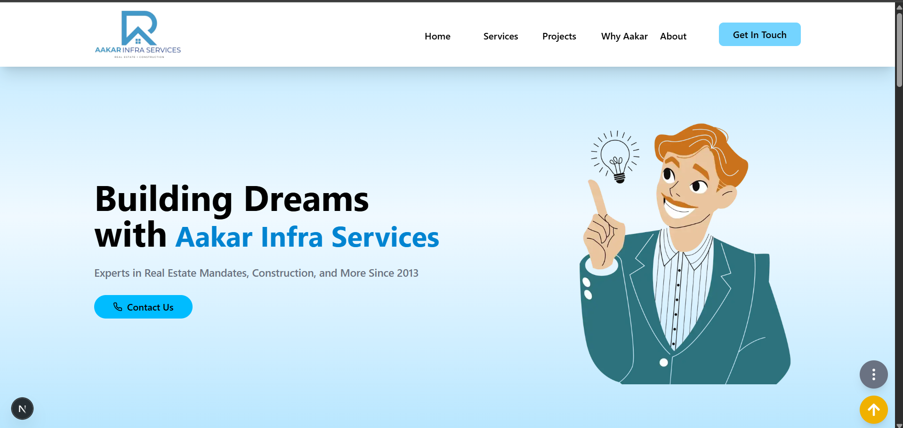

# 🏗️ Aakar Infra Services — Website Clone

This project is a **fully responsive static website clone** of  
**Aakar Infra Services Pvt. Ltd.**, designed to represent a modern corporate real estate brand.  
It includes structured sections such as **Home, Services, Projects, About, Why Choose Us, and Contact**, built with clean UI, smooth animations, and mobile-first design.

---

## 🔗 Project Access

Since this project is not deployed yet, you can currently run it locally:


---

## ✨ Features

- 📱 **Fully responsive layout**
- 🎨 **Modern UI using Tailwind CSS**
- 🧭 **Sticky navbar with smooth scroll**
- 🪄 **Scroll-triggered animations using Framer Motion**
- 🧩 **Reusable modular React components**
- 🏷️ **Data-driven design (JSON mapped UI)**

---

## 🛠️ Tech Stack

| Technology | Usage |
|-----------|--------|
| **Next.js** | Routing, rendering & build system |
| **React** | Component structure |
| **Tailwind CSS** | Styling & layout |
| **Framer Motion** | Entry animations & interactions |
| **React Icons** | Icons for UI clarity |

---

## 🧩 Concepts & Skills Used

- Component-based architecture
- State management using React hooks
- Responsive layouts with Grid & Flexbox
- Animation control using viewport detection
- Clean code structure with centralized data files
- Next.js app routing + scroll behavior handling

---

## 📸 Screenshots

### 🏠 Homepage (Desktop)


### 📱 Homepage (Mobile)


---

## 🚀 Getting Started

To run this project locally:

```bash
git clone <repository-url>
cd aakar-infra-clone
npm install
npm run dev
